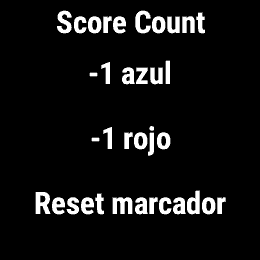
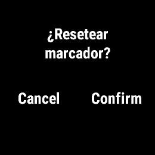
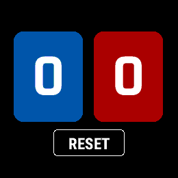
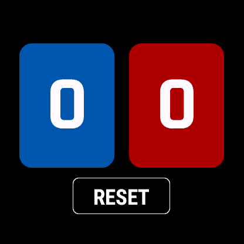

# Validación Garmin

Realizada el **2 de octubre de 2026** con compilador y simulador oficiales
**Connect IQ SDK 9.2.0**, Java 17 y Ubuntu 22.04 en un contenedor con Xvfb.
Esta revisión de controles y diseño modifica únicamente archivos de `garmin/`.
Los archivos Huawei y el README principal conservan el estado de la implementación anterior.

## Procedencia de perfiles

SDK y documentación descargados directamente de `developer.garmin.com`.
La descarga directa de perfiles desde `api.gcs.garmin.com` se intentó de nuevo
tras el cambio de red solicitado, pero seguía bloqueada con HTTP 403.

Para completar la compilación y simulación se utilizaron los perfiles y fuentes
copiados de una instalación de SDK Manager, publicados por
[matco/connectiq-tester](https://github.com/matco/connectiq-tester/tree/5508cf707cbd7435f7f1e9226d2303f4349bfc3b),
con fecha **2026-08-31**. Se extrajeron los datos de la imagen pública
`ghcr.io/matco/connectiq-tester@sha256:64958e8fd2925d0c4986d72a9aa9d8e2101297a881354aab0118be2f1dc22105`.
Se usó el SDK oficial descargado para compilar y ejecutar; no se ejecutó el
runner de esa imagen ni se inventaron perfiles, fuentes o APIs. Es una copia
comunitaria de los recursos de Garmin, no una descarga directa autenticada.
Para pruebas locales y publicación, actualiza los perfiles con tu SDK Manager.
Ni SDK, perfiles, fuentes ni claves privadas se añaden al repositorio.

## Compilación y tests nativos

El manifest mantiene `minApiLevel="2.4.0"`. `BehaviorDelegate.onMenu()`,
`Menu`/`MenuInputDelegate` y `Confirmation`/`ConfirmationDelegate` son APIs 1.0.0.
No se utiliza Menu2 (API 3.0.0), ni medición de duración de botones físicos,
ni dependencias de `onKeyPressed()`/`onKeyReleased()`.

| Perfil | Resolución | Release | Tests Run No Evil |
| --- | --- | --- | --- |
| `fenix7` | 260 × 260 | Correcta | 16/16 PASS |
| `fenix7s` | 240 × 240 | Correcta | 16/16 PASS |
| `epix2` | 416 × 416 | Correcta | 16/16 PASS |
| `fr255` | 260 × 260, sin táctil | Correcta | 16/16 PASS |
| `venu2` | 416 × 416 | Correcta | 16/16 PASS |
| `vivoactive4` | 260 × 260 | Correcta | 16/16 PASS |

Compilaciones finales de aplicación y tests **sin errores ni avisos**.
Exportación `monkeyc -e -r` correcta para los seis perfiles y los 13 destinos
agrupados por Garmin. Firma con clave de prueba externa al repositorio;
SDK, perfiles, fuentes, claves y binarios no se versionan.

Cada perfil ejecutó estos 16 tests sobre la implementación:

1. `KEY_UP`, `KEY_DOWN`, `KEY_ENTER`/`KEY_START` y UNDO consecutivo.
2. BACK/ESC/LAP/LIGHT sin consumir; `onBack`, `onNextPage`, `onPreviousPage`
   y `onSelect` devuelven `false` sin modificar estado, historial ni háptica.
3. Tap/hold azul y rojo, RESET táctil largo, RESET táctil corto sin efecto.
4. Hold repetido y tap duplicado durante/después de hold no suman; siguiente tap válido.
5. RESET y múltiples reinicios conservan puntuación e historial de UNDO.
6. Historial limitado a 25 estados y puntuaciones superiores al máximo de 32 bits.
7. Restas en cero, RESET en cero y UNDO vacío sin cambios ni escrituras.
8. Fallos de escritura preservan estado/historial y no vibran; reintento válido.
9. Datos malformados y fallo de lectura sin sobrescribir datos ilegibles.
10. Zonas de interfaz separadas y adaptables a cinco tamaños de pantalla.
11. Apertura por `onMenu()` y ruta de tecla `KEY_MENU` sin modificar el marcador;
    identificador de menú desconocido no cambia el estado ni la navegación.
12. Selecciones reales de `ScoreCountMenuDelegate` restan ambos equipos;
    restar en cero no escribe, crea historial ni vibra.
13. RESET solicita confirmación antes de modificar `12–8`; `CONFIRM_YES` guarda
    `0–0`, persiste tras reiniciar y permite UNDO a `12–8`.
14. `CONFIRM_NO` conserva puntuaciones, historial, escrituras y háptica.
15. RESET confirmado en `0–0` no crea una entrada inútil ni reemplaza UNDO útil.
16. Fallos de almacenamiento durante restas/RESET de menú preservan estado y háptica.

Se conservan los tests de modelo y táctil; se sustituyen los de duración física
por los del nuevo menú. Los tests usan almacenamiento en memoria y un contador
háptico, y aíslan las operaciones de navegación nativa. La validación interactiva
siguiente comprueba además la pila de vistas, los eventos del SDK y Storage real.

En SDK 9.2.0/Linux, el wrapper `monkeydo ... -t` puede devolver código 1 aunque
Run No Evil termine con `PASSED (passed=16, failed=0, errors=0)`. Se verificó ese
resumen en los seis perfiles: **96/96 tests**, sin fallos ni errores.

## Eventos observados en Fenix 7 y Forerunner 255

Se contrastaron la documentación oficial actual, los `simulator.json` de ambos
perfiles y una aplicación diagnóstica temporal de `BehaviorDelegate`. Esta última
registró eventos sin modificar Score Count ni su almacén. Ambos perfiles dieron
el mismo orden de eventos:

| Entrada | Orden observado en el simulador | Manejo final |
| --- | --- | --- |
| UP corto | Press 13; `onPreviousPage`; `onKey(KEY_UP=13)` al soltar; release 13 | El comportamiento devuelve false; la tecla suma azul |
| DOWN corto | Press 8; `onNextPage`; `onKey(KEY_DOWN=8)` al presionar; release 8 | El comportamiento devuelve false; la tecla suma rojo |
| START corto | Press 4; `onSelect`; `onKey(KEY_ENTER=4)` al presionar; release 4 | El comportamiento devuelve false; la tecla ejecuta UNDO |
| Gesto MENU del perfil (mantener UP) | Press 13; `onMenu()` alrededor de 1 s; release 13 | Abre Menu y devuelve true; no llega `onKey(KEY_UP)` ni un segundo `onKey(KEY_MENU)` |
| BACK/LAP físico del perfil | Press 5; `onBack`; `onKey(KEY_ESC=5)` | Ambos sin consumir en marcador; Garmin sale normalmente |

Los archivos de perfil declaran la tecla `menu` (`KEY_MENU=7`) sobre el mismo
botón UP con `isHold:true` y `behavior:onMenu`. En la app se procesa primero ese
comportamiento nativo; una ruta de `KEY_MENU` queda para perfiles que entreguen
la tecla sin mapear el comportamiento. El botón rotulado START de estos perfiles
entrega **KEY_ENTER**, no KEY_START. BACK/LAP entrega **KEY_ESC**, no KEY_LAP.
Los alias KEY_START/KEY_LAP se cubren en tests, sin afirmar que se hayan emitido
interactivamente. LIGHT no se expone como tecla en estos dos perfiles; su
comportamiento del firmware queda para hardware.

La sonda también mantuvo DOWN y START: el SDK entregó su acción normal al
presionar y luego release, sin simular música ni hotkeys. Por tanto, ese resultado
no demuestra qué ocurrirá al mantenerlos en un reloj. La app no asigna funciones
especiales a duración física y no necesita recibir press/release para puntuar.

En Fenix 7, los perfiles también asignan swipes verticales a Next/PreviousPage y
tap a Select. Esos callbacks retornan `false` sin acciones. Se comprobaron ambos
swipes sin cambios y taps sumando, sin que un tap ejecute UNDO.

## Interacción con la aplicación en ambos simuladores

Se usaron botones de la carcasa y ratón mediante X11 sobre las compilaciones
reales. Se verificaron capturas con OCR después de cada paso, sin invocar el modelo
por código ni modificar directamente Storage.

| Secuencia | Estado verificado |
| --- | --- |
| MENU → Reset marcador → confirmar | 0–0 inicial |
| UP, DOWN, DOWN cortos | 1–2 |
| START tres veces | 1–1, 1–0, 0–0 |
| Dos UP y dos DOWN | 2–2 |
| MENU → −1 azul / −1 rojo, dos veces cada uno | 1–2, 1–1, 0–1, 0–0 |
| Restas de menú en cero | 0–0, retorna al marcador |
| BACK desde menú | Retorna al marcador sin cambios |
| Doce UP y ocho DOWN | 12–8 |
| MENU → Reset marcador → cancelar con BACK | 12–8, retorna directamente al marcador |
| MENU → Reset marcador → confirmar | 0–0 |
| Segundo RESET confirmado en cero, START | 12–8; no se inserta otro RESET |
| BACK, relanzar mismo PRG, START | 12–8 persistente; UNDO a 12–7 |
| RESET confirmado, BACK, relanzar, START | 0–0 persistente; UNDO a 12–7 |

La apertura de menú usó exclusivamente el gesto MENU proporcionado por el
perfil, manteniendo UP hasta que Garmin entregó `onMenu()`. El menú se navega
con UP/DOWN y se selecciona con START. El marcador no recibe esas teclas mientras
el menú o la confirmación están activos. En la confirmación, START confirma y
BACK cancela.

Se comprobó la navegación del menú clásico: una selección normal de resta cierra
Menu por defecto. Un `popView()` adicional cerraría el marcador. RESET sí elimina
explícitamente Menu antes de insertar Confirmation, para que cancelar no deje al
usuario dentro del menú. Confirmation se cierra mediante la navegación nativa;
no se hace otro pop en su respuesta. Las pruebas verifican las vueltas al marcador,
además de los valores del modelo.

En Fenix 7 se repitieron tap azul/rojo, hold azul/rojo, holds estando en cero,
tap posterior a hold, RESET táctil corto/largo, UNDO del RESET táctil y swipes
verticales en ambos sentidos. Cada hold táctil restó una sola vez; se conserva
la protección de 200 ms frente a tap duplicado. Forerunner 255 completó todas
las acciones con los botones y el menú, sin touchscreen.

Capturas nativas de Fenix 7:

## Revisión visual

Se dibujó la aplicación real en Fenix 7 (260 px) y Epix 2 (416 px) y se revisaron
la ausencia de título y etiquetas de equipo, números centrados, contraste,
tarjetas ampliadas y RESET dentro de la pantalla circular. También se revisó
la pantalla del simulador Forerunner 255, sin touchscreen. En Fenix 7S (240 px)
se revisó además una vista de
prueba con `9223372036854775807` y `999999`: el valor largo se divide en tres
líneas sin perder dígitos ni solaparse con RESET. Esa vista temporal usa el
mismo `ScoreCountView` y no forma parte del producto.

Capturas de la aplicación:

No se ha añadido fallback visual: todos los dispositivos del manifest tienen
color. El negro, las dos tarjetas y RESET se mantienen en todos ellos. El nombre
Score Count sigue siendo el nombre de la app en el launcher, sin dibujarse en
el marcador. El aviso de almacenamiento sigue apareciendo si hay un fallo real.

## Pendiente de hardware y publicación

- Acceso a MENU con el firmware y las hotkeys reales de Fenix 7 y FR255: mantener
  UP puede estar reservado, DOWN puede abrir música, y START/combinaciones pueden
  activar atajos del sistema. El simulador no reproduce todas estas reservas.
- Sensación/intensidad de vibración, touchscreen real, bloqueo táctil del reloj,
  iluminación y salida/navegación sobre firmware físico.
- Legibilidad al sol en MIP, brillo/consumo AMOLED y uso durante un partido.
- Pruebas físicas de los demás productos antes de ofrecerlos como compatibilidad
  verificada en hardware. Actualmente se declaran como validados en simulador.
- Los 200 ms posteriores a un hold también ignoran un toque intencional demasiado rápido.
- Icono provisional reutilizado de Huawei; preparar ficha, imágenes, soporte,
  firma definitiva y revisión Garmin antes de publicar.

No quedan errores de compilación ni pruebas nativas fallidas pendientes.
